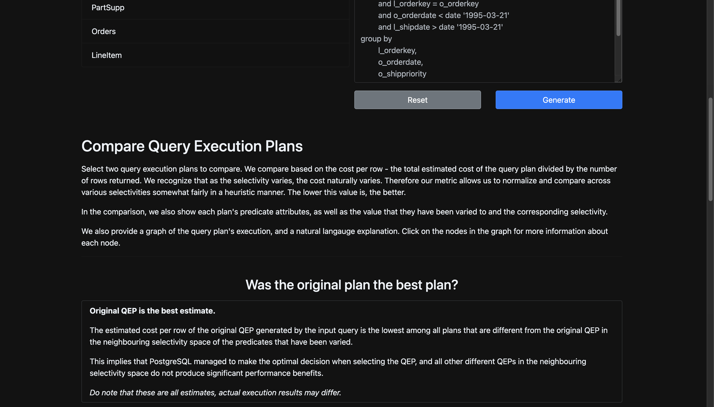
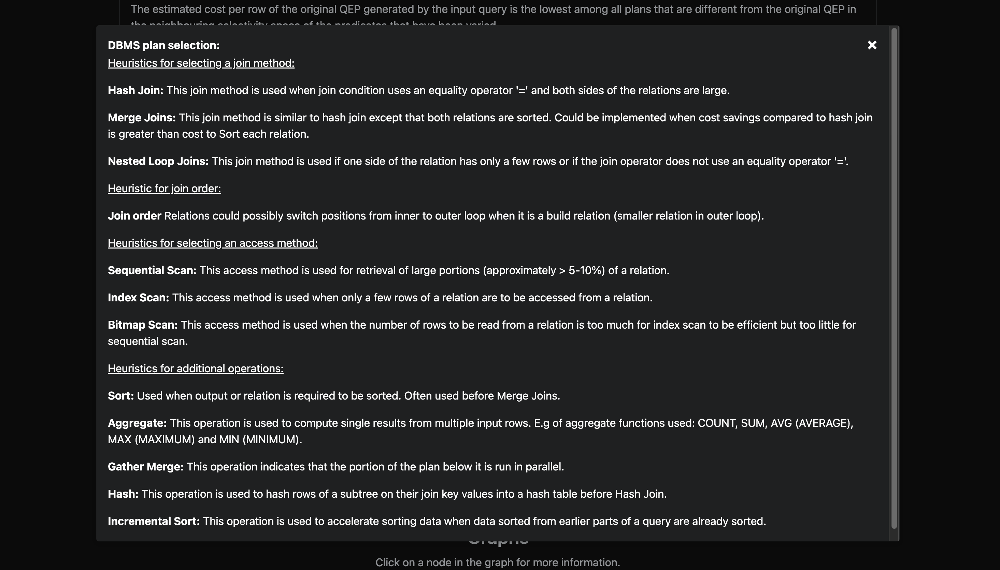
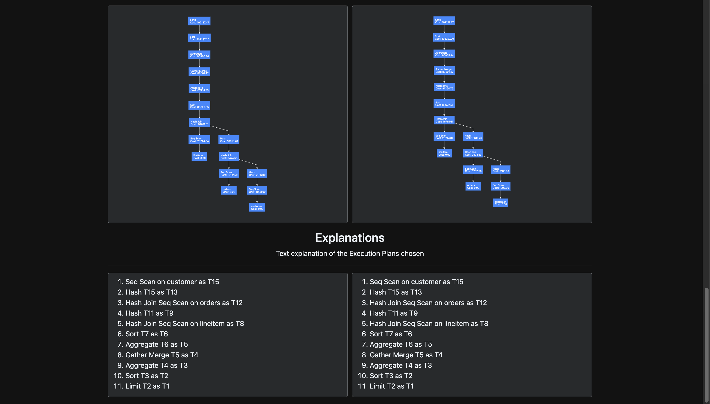

<h1 align="center">Walkthrough Snapshots for OptimaSQL</h1>

This folder contains step-by-step snapshots illustrating the working of the OptimaSQL project. Below is a brief walkthrough of each snapshot to guide you through the functionality of the project.

### 1. Query Input and Predicate Selection

This snapshot demonstrates the interface where users input their SQL queries and select the relevant predicates for optimization.

### 2. QEP Introduction

An introduction to the Query Execution Plan (QEP) is displayed, outlining the process of query optimization.

### 3. QEP Algorithms

This snapshot showcases the different algorithms used to generate alternative execution plans for the given query.

### 4. Base and Alternative QEPs

Here, the base query execution plan is compared with alternative plans to visualize performance improvements.

### 5. QEP Graphs and Explanations

This snapshot provides a graphical representation and detailed explanations of the execution plans, enabling users to understand the trade-offs and choose the best plan.

## About OptimaSQL
**Project:** OptimaSQL: Enhancing Query Performance with Visualization  
An SQL query optimizer that evaluates and executes query plans while visualizing performance through alternative execution plan comparisons.

---

### Additional Details
- **Frontend Setup**: Refer to `Frontend_README` for detailed instructions on setting up the client interface.
- **Backend Setup**: Refer to `Backend_README` for backend server configuration.
- **Database Setup**: Refer to `Database_README` for PostgreSQL setup and TPC-H database integration.

For any issues or further clarifications, please refer to the main repository documentation.
